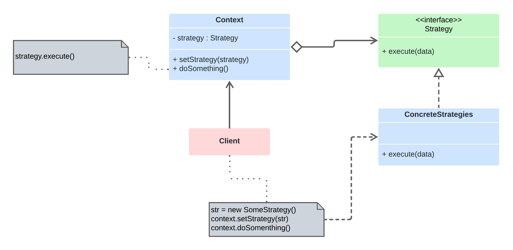

# Strategy

Permite que você defina uma família de algoritmos, coloque-os em classes separadas, e faça os objetos deles intercambiáveis.

## Cmmo Funciona
* Interface Strategy: Define uma interface comum para todos os algoritmos suportados. Cada algoritmo encapsulado por uma classe que implementa esta interface.

* Concrete Strategies: São classes concretas que implementam a interface Strategy, cada uma representando um algoritmo específico ou comportamento.

* Context: É a classe que utiliza uma Strategy. Geralmente, possui uma referência a uma Strategy e pode definir um método que permite alterar a Strategy durante a execução.

## Aplicabilidade
* Quando há múltiplos algoritmos para uma tarefa específica, e é necessário alternar entre eles em diferentes cenários.
* Quando os algoritmos devem ser facilmente substituíveis e não devem impactar os clientes que os utilizam.
* Quando uma classe tem muitos comportamentos condicionais e esses comportamentos são baseados em várias operações que mudam frequentemente.

## Diagrama

