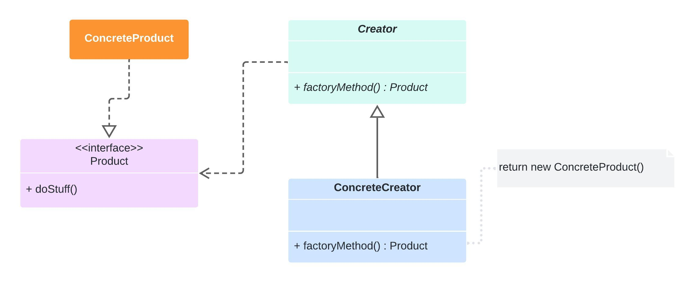

# Factory Method

* Oculta a lógica de instanciação do código cliente. O método fábrica será responsável por instanciar as classes desejadas.
* Dá flexibilidade ao código cliente permitindo a criação de novas factories sem a necessidade de alterar código já escrito (OCP).
* Pode usar parâmetros para determinar o tipo dos objetos a serem criados ou os parâmetros a serem enviados aos objetos sendo criados.

# Aplicabilidade

* Quando não souber com certeza quais os tipos de objetos o seu código vai precisar.
* Para permitir a extensão de suas factories para criação de novos objetos
* Para desacoplar o código que cria do código que usa as classes
* Para eliminar duplicação de código na criação de objetos

## Diagrama (Estrutura)

## Prós e Contra

✔️ Você evita acoplamentos firmes entre o criador e os produtos concretos.

✔️ Princípio de responsabilidade única. Você pode mover o código de criação do produto para um único local do programa, facilitando a manutenção do código.

✔️ Princípio aberto/fechado. Você pode introduzir novos tipos de produtos no programa sem quebrar o código cliente existente.

❌ O código pode se tornar mais complicado, pois você precisa introduzir muitas subclasses novas para implementar o padrão.