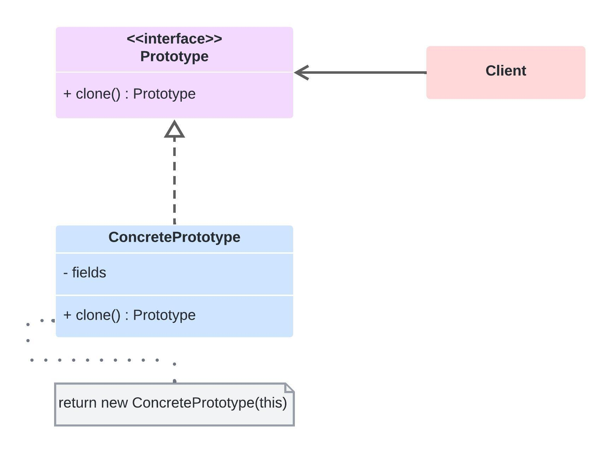

# Prototype

Cria tipos de objetos baseando em um prototipo.

## Aplicabilidade

* Precisar que seu código não dependa de classes concretas para a criação de novos objetos
* Quiser evitar explosão de subclasses para objetos muito similares
* Quiser evitar a recriação de objetos "caros" ou "complexos"

## Diagrama (Estrutura)

## Prós e contras

✔️ Oculta classes concretas do código cliente.

✔️ Ajuda na criação de objetos caros ou complexos.

✔️ Evita a explosão de subclasses.

❌ Clonar objetos que que tem referências para outros objetos pode ser super complexo