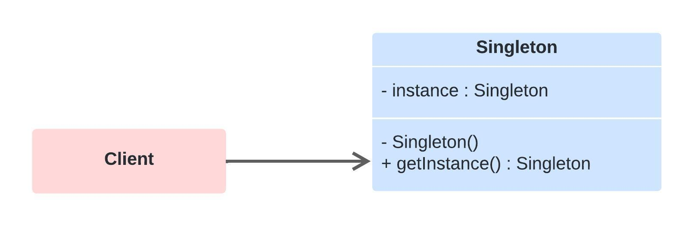

# Singleton
Ele garante que uma classe tenha apenas uma única instância, enquanto fornece um ponto de acesso global a essa instância. Este padrão é usado quando apenas uma instância de uma classe é necessária para controlar as ações em todo o sistema. Ele encapsula um valor único globalmente acessível.

## Aplicabilidade

O Singleton é aplicável em situações onde:

Deve existir apenas uma instância de uma classe, e ela deve ser acessível aos clientes a partir de um ponto de acesso bem conhecido.
Quando a instância única deve ser extensível por subclasses, e os clientes devem poder usar uma instância estendida sem modificar seu código.

## Modo de Usar.

Para implementar o padrão Singleton em um programa, você deve:

* Tornar o construtor da classe privado, para impedir a criação de instâncias fora da classe.
* Criar uma variável estática na classe que armazenará a única instância da classe.
* Fornecer um método estático público que os clientes possam acessar para obter a instância da classe. Este método verifica se uma instância já existe; se não, cria uma e retorna, garantindo que apenas uma instância seja criada.

# Diagrama (Estrutura)

## Prós e contra
✔️ Controle estrito sobre como e quando o acesso à instância única é permitido.

✔️ Pode ser mais econômico, pois evita a criação constante de objetos quando um único objeto é suficiente.

✔️ Pode ser usado para controlar recursos compartilhados, como conexões de banco de dados.

❌ Viola o princípio da responsabilidade única, pois o Singleton trata do próprio ciclo de vida e também das operações lógicas.

❌ Pode introduzir um ponto de falha global no software, já que uma instância única que falha pode causar problemas em todo o sistema.

❌ O uso inadequado pode levar a problemas em ambientes multithread se não for corretamente sincronizado, resultando em múltiplas instâncias.

❌ Dificulta os testes, pois carrega estado que pode não ser fácil de mockar ou remover entre os testes, resultando em testes dependentes de estado que podem ser executados antes.