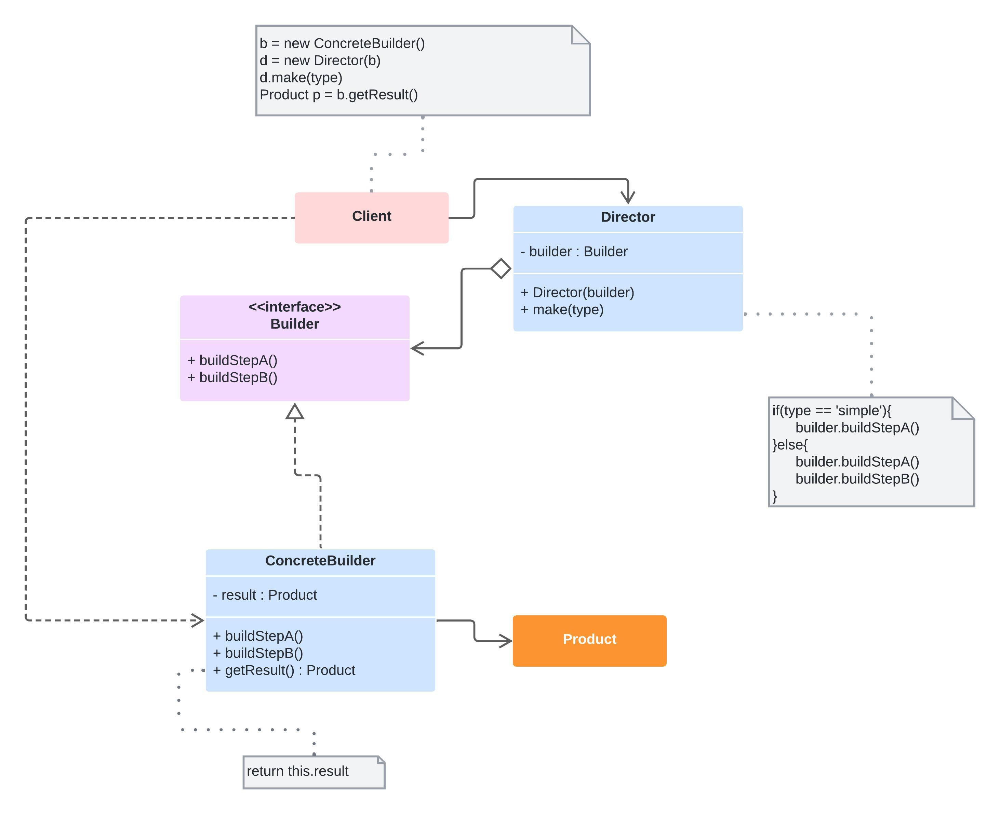

# Builder

* Trata da criação de objetos complexos (complexos de verdade), como:
    * Objetos com construtores muito complexos
    * Objetos compostos de vários objetos (composite)
    * Objetos com algoritmo de criação complexo

Além disso, o padrão também:

* Permite a criação de um objeto em etapas
* Permite method chaining (encadeamento de métodos)
* Permite que o objeto final varie em dados e tipo

## Diagrama (Estrutura)

## Aplicabilidade

* Quando a criação do objeto se torna complexa
* Quando quiser que o código seja capaz de gerar diferentes representações do mesmo objeto

## Prós e contras

✔️ Separa criação de utilização de objetos

✔️ O cliente não precisa criar objetos diretamente

✔️ O mesmo código pode construir objetos diferentes

✔️ Ajuda na aplicação dos princípios SRP e OCP

❌ Pode final complexo