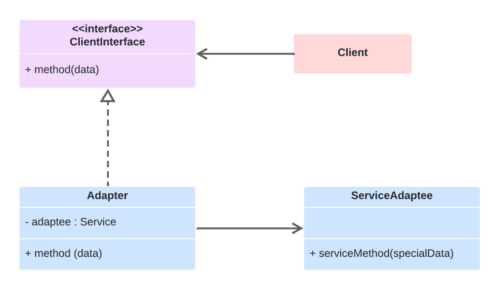

# Adapter

É um padrão estrutural que permite a colaboração entre objetos com interfaces incompatíveis. Imagine que você tem dois sistemas: um novo e um legado, onde o sistema legado utiliza métodos que o novo sistema não pode diretamente invocar devido a diferenças nas interfaces. O Adapter atua como um intermediário, traduzindo chamadas de uma interface para outra sem que os sistemas tenham que saber sobre a existência um do outro.

## Como funciona

O padrão Adapter envolve a criação de uma classe de adaptador que se conecta entre a interface desejada e a interface existente. Esta classe adaptadora implementa a interface desejada e encapsula a classe que tem a interface incompatível. Quando um cliente chama um método na interface desejada, o adaptador traduz essa chamada para uma ou mais chamadas à interface incompatível de maneira apropriada.

## Aplicabilidade

* Integração de Sistemas: Facilitar a comunicação entre novos sistemas e sistemas legados.
* Bibliotecas de Terceiros: Quando se deseja usar uma biblioteca de terceiros que tem interfaces diferentes das do seu sistema.
* Refatoração de Código: Em cenários onde o código precisa ser refatorado, mas mudar a interface pode afetar muitos outros componentes do sistema.

## Diagrama (Estrutura)

## Prós e contra

✔️ Interoperabilidade: Permite que objetos com interfaces incompatíveis trabalhem juntos.

✔️ Reusabilidade: Facilita a reutilização de código existente sem modificar seu código-fonte, mesmo se suas interfaces não combinarem com as necessidades atuais.

✔️ Flexibilidade: Oferece uma maneira de alterar o comportamento de classes existentes sem alterar seu código

❌ Complexidade: Pode aumentar a complexidade do código ao introduzir uma série de pequenas classes adaptadoras, especialmente se o sistema começar a depender muito deste padrão para integrar muitas funcionalidades incompatíveis.

❌ Desempenho: A camada extra de abstração introduzida pelo adaptador pode resultar em uma pequena penalidade de desempenho, embora, na prática, isso raramente seja significativo.
