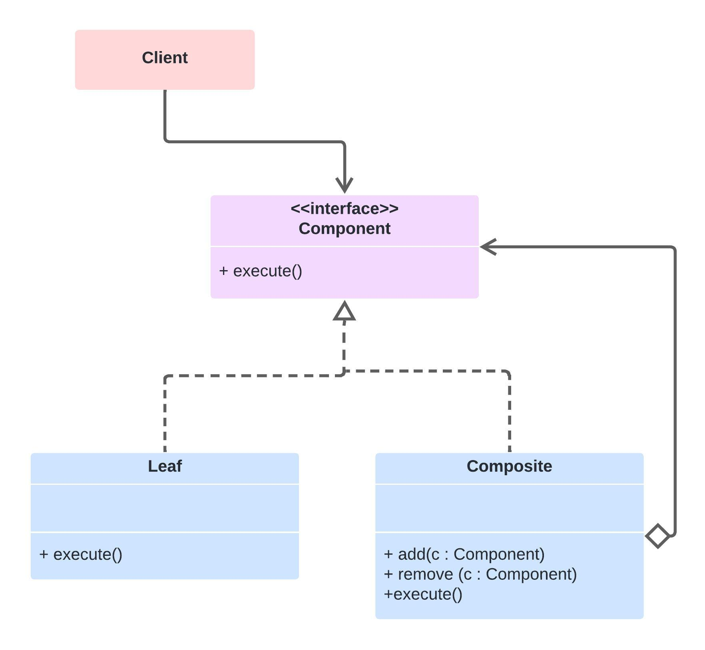

# Composite

É um padrão de projeto estrutural que permite que você componha objetos em estruturas de árvores e então trabalhe com essas estruturas como se elas fossem objetos individuais.

## Como Funciona

* Componente: É a interface ou classe abstrata que define operações comuns para os objetos simples e para os compostos. Ela permite que os clientes tratem todos os objetos na composição de maneira uniforme.

* Folha (Leaf): Representa os objetos finais na composição que não têm filhos. Implementa as operações definidas pela interface Componente.

* Composto (Composite): É um objeto que tem filhos. Esses filhos podem ser tanto objetos Leaf quanto outros objetos Composite. Um objeto Composite armazena seus filhos e implementa as operações da interface Componente, geralmente delegando a responsabilidade de executar essas operações para seus filhos.

## Driagrama

## Aplicabilidade

* Quando você quer representar hierarquias parte-todo de objetos.
* Deseja que os clientes ignorem a diferença entre composições de objetos e objetos individuais. Ou seja, os clientes tratam todos os objetos na composição de maneira uniforme.

## Prós e contra
✔️ Flexibilidade de Estrutura: Permite criar estruturas de objetos complexas, mas ainda assim trabalhar com essas estruturas como se fossem objetos individuais.

✔️ Simplicidade para os Clientes: Os clientes usam composições e objetos simples da mesma maneira, o que simplifica o código do cliente.

✔️ Facilidade de Adição de Novos Tipos de Componentes: Como a interface Componente define operações padrão, é fácil adicionar novos tipos que se encaixem na estrutura existente sem alterar o código que usa a estrutura.

❌ Dificuldade em Restringir Tipos de Componentes: Pode ser difícil garantir que uma composição tenha apenas determinados tipos de objetos, já que tudo é tratado de forma uniforme.

❌ Overhead de Performance em Alguns Casos: Em estruturas muito profundas ou complexas, pode haver um overhead de performance devido à necessidade de iterar por muitos objetos.

❌ Design Mais Complexo: Pode ser mais difícil de projetar sistemas que efetivamente utilizam o Composite, uma vez que a flexibilidade do padrão também traz complexidade.