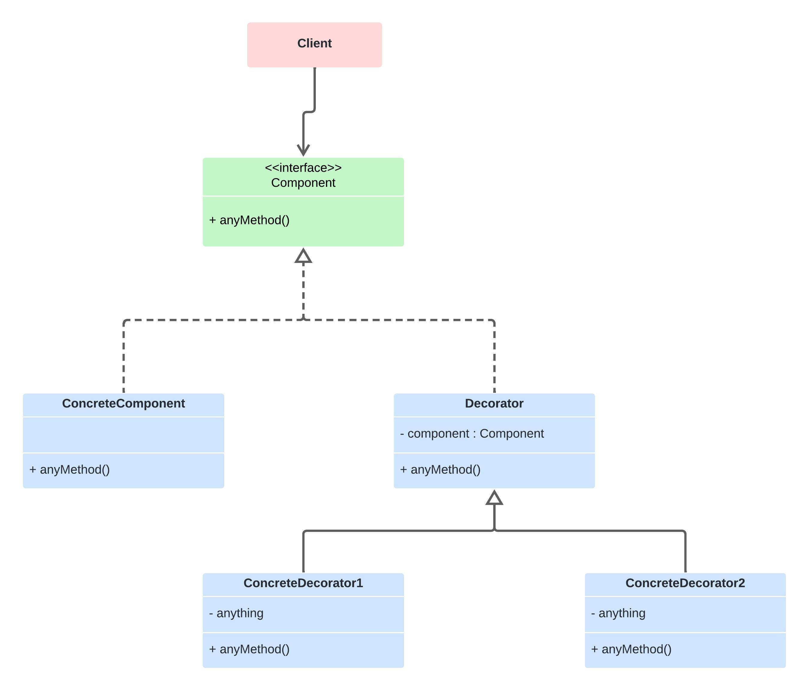

# Decorator

Permite a adição de novos comportamentos a objetos, dinamicamente, ao colocá-los dentro de objetos de wrapper especiais. Usando esse padrão, você pode modificar o comportamento de um objeto individual sem afetar o comportamento de outros objetos da mesma classe.

## Princípios Básicos de Decorator

* Herança
* Composição
* Adição de Funcionalidades

## Estrutura Básica

* Component - Interface ou classe abstrata que define as operações.
* ConcreteComponent - Classe que implementa ou estende o Component.
* Decorator - Classe abstrata que herda ou implementa o component.
* ConcreteDecorator - Classe que estende Decorator e implementa os componentes adicionais.

## Diagrama
